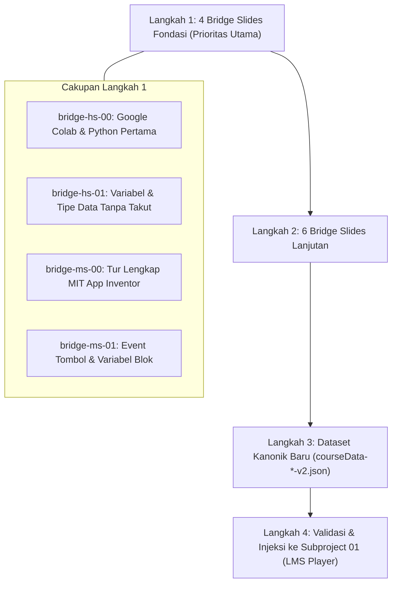

# Implementation Plan 02: Kurikulum Scaffolding SMP–SMA dari Nol, Template Slides, & Aset Ruangguru CDN

Diperbarui *in-place* pada 2026-09-08. Dokumen ini menjadi acuan kerja eksekusi Subproject 02 (Curriculum Sequencing) untuk menjembatani siswa pemula murni (*zero-experience*) menggunakan materi video eksisting + materi jembatan (*Bridge Slides*) baru.

---

## 1. Prinsip Pokok & Standar Eksekusi

1. **Zero-Touch Folder Lama**:
   - Folder sumber di `/Users/yazidhilmi/Documents/cloud/Kalananti-cloud/Academic_Content/B2B/UOB/Async/` bersifat **STRICTLY READ-ONLY**.
   - Seluruh berkas baru (slide decks, skrip otomasi, aset visual, dataset JSON kanonik) dibuat baru (*completely new*) langsung di dalam folder proyek lokal `projects/uob-async-lms/subprojects/02-curriculum-sequencing/`.
2. **Preservasi Metadata Video Kurasi 100%**:
   - Nilai `videoId`, `startSeconds`, `endSeconds`, dan `bookmarks` dari video eksisting dipreservasi utuh tanpa dinormalisasi atau diubah.
3. **Template Visual Slide Konsisten**:
   - Mengadopsi arsitektur visual simulator interaktif 16:9 (`Fredoka`, neo-brutalist space palette: `#FFE500`, `#00C6FF`, `#1A1A1A`, `#00E676`, `#FF3366`).
   - Setiap slide memiliki kartu ringkasan kiri (Label, Judul, Highlight Items ber-ikon, Keynote Box) dan kartu visual kanan (Frame gambar beresolusi tinggi, badge zoom modal, caption bar).
4. **Alur Aset Visual & Ruangguru CDN**:
   - Screenshot antarmuka asli (Google Colab & MIT App Inventor) diambil menggunakan otomasi Chrome via Playwright CDP (`http://localhost:9222`).
   - Aset visual diunggah ke Ruangguru CDN (`https://file-uploader.sirogu.com/`, bucket `rg_cdn_web_2`) via script uploader lokal.
   - URL CDN yang dihasilkan (`https://cdn-web-2.ruangguru.com/...`) disematkan langsung ke dalam konten slide.

---

## 2. Roadmap 4 Langkah Eksekusi Subproject 02



---

## 3. Spesifikasi Rinci Langkah 1 (4 Bridge Slides Fondasi Pertama)

### A. `bridge-hs-00`: Mengenal Google Colab & Python Pertama (SMA)
- **Target Pembelajaran**:
  1. Memahami apa itu Google Colaboratory dan kenapa cocok untuk belajar Python tanpa instalasi rumit.
  2. Membuka notebook baru di Google Colab.
  3. Menulis instruksi pertama `print("Halo, UOB!")` di dalam Code Cell.
  4. Menekan tombol Run dan membaca hasil eksekusi (Output) tepat di bawah cell.
  5. Menyimpan file notebook ke Google Drive pribadi.
- **Rencana Slide (6 Slide)**:
  - Slide 1: *Selamat Datang di Dunia Koding Python!* (Konsep Input → Proses → Output).
  - Slide 2: *Membuka Google Colab Pertama Kali* (Akses `colab.research.google.com` & Buat Notebook).
  - Slide 3: *Mengenal Code Cell* (Kotak tempat menulis perintah komputer).
  - Slide 4: *Menulis Fungsi `print()`* (Perintah menampilkan teks ke layar).
  - Slide 5: *Menjalankan Kode & Membaca Output* (Tombol Play / `Ctrl+Enter`).
  - Slide 6: *Rangkuman & Tantangan Mandiri* (Tantangan mencetak nama dan sekolah).
- **Aset Visual & Screenshot Target**:
  - `colab-landing-new-notebook.png` (Screenshot halaman Colab membuat notebook baru).
  - `colab-code-cell-print.png` (Screenshot penulisan `print()` dan tombol Run).
  - `colab-output-result.png` (Screenshot hasil output teks di bawah cell).

### B. `bridge-hs-01`: Variabel & Tipe Data Tanpa Takut (SMA)
- **Target Pembelajaran**:
  1. Memahami variabel sebagai "kotak berlabel" untuk menyimpan informasi di memori.
  2. Menggunakan tanda sama dengan `=` sebagai operator *assignment* (penugasan nilai).
  3. Membedakan 4 tipe data dasar: String (teks diapit tanda kutip), Integer (bilangan bulat), Float (angka desimal), dan Boolean (`True`/`False`).
  4. Memahami kenapa `"10"` (teks) berbeda dengan `10` (angka).
  5. Operasi matematika dasar pada variabel (`+`, `-`, `*`, `/`).
- **Rencana Slide (8 Slide)**:
  - Slide 1: *Variabel: Kotak Berlabel Komputer* (Analogi kotak penyimpanan barang).
  - Slide 2: *Cara Membuat Variabel di Python* (Sintaks `nama_variabel = nilai`).
  - Slide 3: *Tipe Data 1: String (Teks)* (Ciri tanda petik `"..."`).
  - Slide 4: *Tipe Data 2: Integer & Float (Angka)* (Bilangan bulat vs desimal titik `.`).
  - Slide 5: *Jebakan Klasik: Teks `"10"` vs Angka `10`* (Penggabungan string vs penjumlahan matematika).
  - Slide 6: *Tipe Data 3: Boolean (`True` / `False`)* (Kondisi saklar lampu / status benar-salah).
  - Slide 7: *Operasi Hitung Variabel Keuangan Sederhana* (`saldo = uang_masuk - uang_keluar`).
  - Slide 8: *Rangkuman & Kuis Cek Pemahaman* (Prediksi output dari 3 baris kode).
- **Aset Visual & Diagram Target**:
  - `diagram-variable-box-analogy.png` (Diagram analogi kotak berlabel).
  - `colab-data-types-run.png` (Screenshot Colab menjalankan demonstrasi tipe data).

### C. `bridge-ms-00`: Tur Lengkap MIT App Inventor (SMP)
- **Target Pembelajaran**:
  1. Mengenal platform visual MIT App Inventor untuk membuat aplikasi Android.
  2. Membedakan 2 layar utama: **Designer Tab** (desain tampilan) vs **Blocks Tab** (logika pemrograman).
  3. Menemukan 4 area penting Designer: Palette (katalog komponen), Viewer (layar HP), Components List, dan Properties (pengaturan warna/ukuran/teks).
  4. Cara menghubungkan proyek ke HP Android menggunakan **MIT AI2 Companion** (scan QR code).
- **Rencana Slide (6 Slide)**:
  - Slide 1: *Selamat Datang di MIT App Inventor!* (Membuat aplikasi HP sungguhan lewat blok visual).
  - Slide 2: *Dua Ruang Kerja Utama: Designer vs Blocks* (Membedakan tampilan vs otak aplikasi).
  - Slide 3: *Tur Area Designer: Palette & Viewer* (Menarik komponen tombol dan teks ke layar HP).
  - Slide 4: *Tur Area Designer: Components & Properties* (Mengganti nama tombol dan warna latar).
  - Slide 5: *Menguji Aplikasi di HP dengan AI Companion* (Scan QR Code via aplikasi Companion).
  - Slide 6: *Rangkuman & Checklist Siap Koding* (Checklist verifikasi komponen).
- **Aset Visual & Screenshot Target**:
  - `appinventor-designer-overview.png` (Screenshot beranotasi 4 area Designer).
  - `appinventor-blocks-overview.png` (Screenshot antarmuka Blocks Editor).
  - `appinventor-companion-qr.png` (Screenshot modal Connect AI Companion).

### D. `bridge-ms-01`: Event Tombol, Properti, & Variabel Blok (SMP)
- **Target Pembelajaran**:
  1. Memahami konsep *Event-Driven Programming*: komputer bertindak saat sesuatu terjadi (`when Button.Click`).
  2. Mengambil teks masukan pengguna dari properti `TextBox.Text`.
  3. Menampilkan hasil respon ke layar dengan mengubah properti `Label.Text`.
  4. Menggunakan blok variabel (`initialize global ...`, `get`, `set`) sebagai memori sementara.
  5. Memahami alur kerja komputasi: **Input** (ketik nama) → **Proses** (susun sapaan) → **Output** (tampil di label).
- **Rencana Slide (7 Slide)**:
  - Slide 1: *Bagaimana Aplikasi Bereaksi?* (Konsep aksi-reaksi / Event-Driven).
  - Slide 2: *Blok Emas: `when Button.Click`* (Otak di balik tombol yang ditekan).
  - Slide 3: *Membaca Masukan Pengguna: `TextBox.Text`* (Mengambil data yang diketik user).
  - Slide 4: *Menampilkan Jawaban: Mengubah `Label.Text`* (Blok `set Label.Text to ...`).
  - Slide 5: *Menggabungkan Teks dengan `join`* (Menyusun kalimat: `"Halo, "` + `TextBox.Text`).
  - Slide 6: *Menyimpan Data Sementara di Variabel Blok* (Membuat dan memanggil variabel global).
  - Slide 7: *Rangkuman & Simulasi Alur Input-Proses-Output*.
- **Aset Visual & Diagram Target**:
  - `appinventor-event-click-blocks.png` (Screenshot blok `when Button1.Click` + `set Label1.Text`).
  - `diagram-input-process-output.png` (Diagram visual alur I-P-O ramah anak).

---

## 4. Format Kontrak Template Slide (`template-slide-deck.json` & `.html`)

Setiap modul slide memiliki struktur data terpadu (*uniform contract*):
```json
{
  "id": "bridge-hs-00",
  "level": "SMA",
  "kicker": "Materi Jembatan 00 · Dasar Python",
  "title": "Membuka Python Pertama Kali di Google Colab",
  "duration": "7 Menit Baca & Praktik",
  "type": "slides",
  "summary": "Google Colab adalah editor Python berbasis web gratis. Kamu menulis perintah di Code Cell, menekan tombol Run, dan membaca hasilnya tepat di bawah cell.",
  "bookmarks": [
    { "slideIndex": 0, "label": "Pengantar Python" },
    { "slideIndex": 1, "label": "Membuka Google Colab" },
    { "slideIndex": 2, "label": "Mengenal Code Cell" },
    { "slideIndex": 3, "label": "Fungsi print()" },
    { "slideIndex": 4, "label": "Menjalankan & Output" },
    { "slideIndex": 5, "label": "Rangkuman & Praktik" }
  ],
  "slides": [
    {
      "slideIndex": 0,
      "tagPill": { "text": "🚀 Dasar Koding", "color": "yellow" },
      "title": "Selamat Datang di Dunia Koding Python!",
      "highlights": [
        {
          "icon": "🧠",
          "label": "Bahasa Paling Ramah",
          "sub": "Sintaks Python mirip bahasa Inggris sehari-hari"
        },
        {
          "icon": "⚡",
          "label": "Tanpa Perlu Instalasi",
          "sub": "Cukup buka browser dan langsung koding di Google Colab"
        }
      ],
      "keynote": "Komputer bekerja dengan pola: Input (masukan) -> Proses (olah kode) -> Output (hasil ke layar).",
      "visual": {
        "cdnUrl": "https://cdn-web-2.ruangguru.com/landing-pages/assets/...",
        "caption": "📸 Ilustrasi: Alur Kerja Eksekusi Python",
        "altText": "Alur Kerja Eksekusi Python"
      }
    }
  ],
  "quiz": {
    "question": "Di mana kita menuliskan perintah kode Python pada Google Colab?",
    "options": ["A. Di papan ketik HP", "B. Di dalam Code Cell", "C. Di kolom komentar YouTube", "D. Di pencarian Google"],
    "answer": 1,
    "explanation": "Kode Python di Google Colab ditulis di dalam blok khusus bernama Code Cell sebelum dijalankan."
  }
}
```

---

## 5. Pipeline Otomasi Screenshot & CDN Ruangguru

1. **Pengambilan Screenshot via Chrome CDP**:
   - Menghubungkan script Playwright ke Chrome port 9222 (`http://localhost:9222`).
   - Membuka halaman Google Colab (`https://colab.research.google.com/`) dan MIT App Inventor (`https://ai2.appinventor.mit.edu/`).
   - Mengambil screenshot viewport bersih beresolusi tajam (1280x720 / 16:9).
2. **Batch Upload ke Ruangguru CDN**:
   - Menjalankan script uploader `subprojects/02-curriculum-sequencing/scripts/upload_to_cdn.py`.
   - Mengunggah file ke bucket `rg_cdn_web_2` di `https://file-uploader.sirogu.com/`.
   - Menangkap URL CDN yang terbit (`https://cdn-web-2.ruangguru.com/landing-pages/assets/...`).
   - Menyimpan pemetaan lokal di `subprojects/02-curriculum-sequencing/assets/cdn-map.json`.
3. **Penyematan URL CDN**:
   - Otomatis menyuntikkan URL CDN resmi ke dalam berkas slide JSON dan HTML.

---

## 6. Rencana Verifikasi & Uji Mutu

1. **Verifikasi Schema JSON**: Script validasi memastikan seluruh 4 slide deck memiliki struktur lengkap (metadata, bookmarks, slides, keynote, visual CDN URL, dan kuis cek pemahaman).
2. **Verifikasi Aset CDN**: Pemeriksaan HTTP Status Code 200 untuk seluruh link gambar CDN Ruangguru guna memastikan gambar terbit sempurna dan tidak ada link rusak (*broken image*).
3. **Verifikasi Keterbacaan Visual**: Membuka preview slide di Chrome lokal untuk memastikan proporsi tata letak 16:9, kontras warna, ukuran font, dan modal zoom berfungsi mulus.

