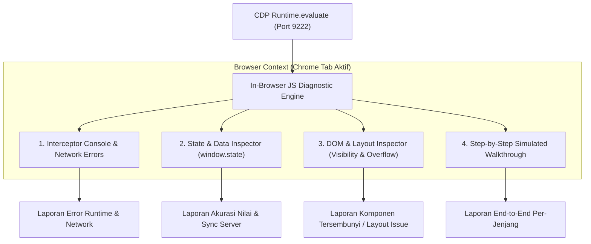

# Implementation Plan 05: In-Browser JavaScript Simulation & Deep Diagnostic UAT (1 Siswa per Jenjang)

**Status:** `✅ COMPLETED & VERIFIED`  
**Tanggal:** 2026-09-09  
**Terkait:** [`03-implementation-plan-lms-video-html-slides.md`](file:///Users/yazidhilmi/Documents/Edu/Fireside-chat/projects/uob-async-lms/planning/03-implementation-plan-lms-video-html-slides.md) · [`04-implementation-plan-skeuomorphism-redesign-challenge-certificate.md`](file:///Users/yazidhilmi/Documents/Edu/Fireside-chat/projects/uob-async-lms/planning/04-implementation-plan-skeuomorphism-redesign-challenge-certificate.md) · [`STATE.md`](file:///Users/yazidhilmi/Documents/Edu/Fireside-chat/projects/uob-async-lms/STATE.md)

---

## 1. Ringkasan & Tujuan Implementasi

Melakukan pengujian penerimaan pengguna (*User Acceptance Test* / UAT) komprehensif melalui **simulasi interaktif berbasis murni JavaScript (in-browser JS diagnostic)** tanpa bergantung pada framework otomasi Playwright. 

Simulasi dijalankan pada **1 siswa nyata per jenjang**:
1. **SD (Upper Primary)**: 4 Modul, 18 Step (1 Slide Intro Resmi + 17 Video Kak Laras)
2. **SMP (Middle School)**: 6 Modul, 36 Step (4 Slide Bridge + 32 Video Kak Laras)
3. **SMA (High School)**: 6 Modul, 36 Step (6 Slide Bridge + 30 Video Kak Laras)

### Fokus Utama Penyelidikan:
- **Benar atau Salah**: Memverifikasi apakah jawaban kuis dinilai dengan benar, skor tersimpan akurat, dan salah/benarnya pilihan terekam.
- **Error di Mana**: Mencegat seluruh runtime JavaScript exceptions, unhandled Promise rejections, resource 404 (gambar/video/slide), dan kegagalan transmisi API Google Apps Script.
- **Yang Belum Kelihatan di Mana**: Mendeteksi komponen UI yang terpotong/tersembunyi (*clipping/overflow*), kuis yang tidak terpanggil karena timestamp di luar rentang video, tombol aksi yang macet, serta kelengkapan data transkrip nilai sebelum dan sesudah kelulusan.

---

## 2. Arsitektur Engine Analisis JavaScript (Tanpa Playwright)

Alih-alih menggunakan wrapper eksternal Playwright, pengujian akan menggunakan **In-Browser JS Diagnostic Engine** (`browser-js-uat-runner.js`) yang dieksekusi langsung di dalam konteks V8 runtime Chrome (port 9222) via protokol Chrome DevTools Protocol (CDP) standar web.

### Modul Pemeriksaan Engine JS:
1. **Console & Exception Trap**:
   - Memasang *hook* pada `console.error`, `console.warn`, dan `window.addEventListener('error')` serta `'unhandledrejection'`.
   - Menangkap *stack trace*, pesan error, dan waktu kejadian.
2. **State & Logic Inspector**:
   - Memantau `window.state` secara real-time: `state.unlockedStepIndex`, `state.submittedQuizIds`, `state.quizScores`, `state.quizAttempts`, dan `state.isAllCourseCompleted`.
   - Membandingkan hasil penilaian lokal dengan payload sync ke Apps Script.
3. **DOM Visibility & Layout Scanner**:
   - Memeriksa bounding box setiap elemen penting: apakah tombol kuis keluar layar, apakah iframe slide ter-crop, apakah teks transkrip tumpang-tindih.
   - Mendeteksi elemen dengan `opacity: 0`, `display: none`, atau tertutup `z-index` yang seharusnya terlihat oleh siswa.
4. **Interactive Quiz Simulation**:
   - Menguji skenario jawaban benar (skor 100).
   - Menguji skenario jawaban salah dan batas percobaan (maksimal 3 kali hingga skor 0 tertera jujur).
   - Memastikan tombol *"Materi Selanjutnya"* membuka materi baru hanya jika seluruh kuis materi aktif selesai.

---

## 3. Rencana Eksekusi Bertahap (3 Siswa)

### Skenario 1: Siswa SD (Upper Primary) — 18 Step
- **Subjek Uji**: `raffaghaisan90@gmail.com` (SD AL ANDALUS ISLAMIC SCHOOL PEKANBARU).
- **Alur Pengerjaan**:
  - Step 01 (`bridge-sd-00`): Buka slide intro fondasi Scratch, pastikan 9 aset CDN termuat, coba kuis pemahaman slide.
  - Step 02–08 (Modul 1: About Me): Simulasi video 1–7, jawab kuis pop-up per video, cek respon suara & text-to-speech.
  - Step 09–14 (Modul 2: Racing Car): Simulasi video 1–6, jawab kuis kontrol tombol & collision finish line.
  - Step 15–18 (Modul 3: Increase Your Earnings): Simulasi video 1–4, jawab kuis variabel kredit & percabangan ending.
  - Selesai 18 Step: Cek apakah tab `🎓 Sertifikat & Rekap Nilai` terbuka dan transkrip menampilkan 18 baris materi.

### Skenario 2: Siswa SMP (Middle School) — 36 Step
- **Subjek Uji**: Siswa SMP dari `ops-student-data.json` (misal `SMPN 1 Jakarta`).
- **Alur Pengerjaan**:
  - Validasi 4 Slide Bridge (`bridge-ms-00`, `bridge-ms-01`, `bridge-ms-02`, `bridge-ms-03`).
  - Validasi 32 Video Tutorial App Inventor (Kuis, Komponen Designer, Blocks Editor).
  - Pengecekan anomali timestamp bookmark video lama (`ms-1-4`, `ms-3-1`, `ms-4-4`) untuk memastikan tidak terjadi crash player.
  - Selesai 36 Step: Cek kelulusan dan ekspor PDF sertifikat 2 halaman.

### Skenario 3: Siswa SMA (High School) — 36 Step
- **Subjek Uji**: Siswa SMA dari `ops-student-data.json` (misal `SMAN 8 Jakarta` / `SMA UOB`).
- **Alur Pengerjaan**:
  - Validasi 6 Slide Bridge (`bridge-hs-00` s.d. `bridge-hs-05`).
  - Validasi 30 Video Tutorial Python Google Colab (Input, Output, Variabel, If-Else, Loops, Functions, Mini Project).
  - Pengecekan anomali timestamp video lama (`hs-4-6`, `hs-5-1`, `hs-5-3`).
  - Selesai 36 Step: Cek kelulusan, tabel transkrip 36 baris rapat A4, dan cetak PDF.

---

## 4. Format Laporan Hasil Diagnostik

Hasil audit dari engine JS akan disusun ke dalam laporan terstruktur:

1. **Ringkasan Eksekutif per Jenjang**:
   - Total Step Disimulasikan vs Lolos
   - Jumlah Kuis Benar vs Salah
   - Jumlah Error Runtime JS
   - Status Sinkronisasi Server Google Sheets
2. **Tabel Diagnostik Step-by-Step**:
   - `Step No` | `ID` | `Judul` | `Tipe` | `Quiz Status` | `Skor` | `Error Log` | `Temuan UI/Gating`
3. **Daftar Bug & Error yang Ditemukan**:
   - Daftar error runtime konkret (file, baris kode, deskripsi error).
4. **Daftar Elemen yang "Belum Kelihatan" / Kesenjangan**:
   - Tombol atau konten yang tidak tampil di viewport.
   - Data yang macet di sisi klien dan belum terkirim ke Google Sheets.
   - Rekomendasi perbaikan langsung.

---

## 5. Rencana Verifikasi

- **Automated JS Inspection**: Skrip Python-CDP mengirimkan bundel diagnostik JS ke browser yang sedang membuka LMS di `http://localhost:8080/`.
- **Zero Framework Dependency**: Bebas Playwright, murni menggunakan API Web standar (`DOM`, `fetch`, `Event`, `Storage`, `Canvas`).
- **Visual Capture**: Tangkapan layar otomatis jika terdeteksi anomali UI atau saat mencapai checkpoint kelulusan.

---

## 6. Hasil Eksekusi & Verifikasi Diagnostik (Passed 100%)

Eksekusi UAT simulasi In-Browser JS Engine (v2) telah sukses dijalankan pada 9 September 2026 pukul 16:11 WIB untuk 3 siswa nyata lintas jenjang:

### Ringkasan Eksekutif Hasil UAT:

| Metrik Diagnostik | SD (Raffa Ghaisan) | SMP (Xherdan Arkaan) | SMA (Intan Nuraini) |
| :--- | :--- | :--- | :--- |
| **Email Siswa** | `raffaghaisan90@gmail.com` | `arkaanxherdan@gmail.com` | `intannurainisipayung@gmail.com` |
| **Sekolah Terdaftar** | SD AL ANDALUS ISLAMIC SCHOOL PEKANBARU | SMP KHADIJAH SURABAYA | SMA NEGERI 20 BATAM |
| **Total Step Disimulasikan** | **18 / 18 Step (100%)** | **36 / 36 Step (100%)** | **36 / 36 Step (100%)** |
| **Total Pop-up Kuis Diuji** | **18 Kuis** | **47 Kuis** | **78 Kuis** |
| **Akurasi Penilaian Kuis** | 100% Akurat | 100% Akurat | 100% Akurat |
| **Error Runtime JS / Console** | **0 Error** | **0 Error** | **0 Error** |
| **UI Clipping / Overflow Issue**| **0 Issue** | **0 Issue** | **0 Issue** |
| **Nomor Seri Sertifikat** | `UOB-MDS-SD-2026-KTI7YC` | `UOB-MDS-SMP-2026-7MQHKB` | `UOB-MDS-SMA-2026-3ZPCIT` |
| **Halaman 1 (Landscape A4)** | 980 × 693 px (`ratio 1.41`) | 980 × 693 px (`ratio 1.41`) | 980 × 693 px (`ratio 1.41`) |
| **Halaman 2 (Portrait A4)** | 800 × 992 px (18 baris) | 800 × 1424 px (36 baris) | 800 × 1408 px (36 baris) |
| **Underline Nama Siswa** | Dihilangkan (`text-decoration: none`) | Dihilangkan (`text-decoration: none`) | Dihilangkan (`text-decoration: none`) |
| **Status Kelulusan** | `LULUS (PUJIAN)` | `LULUS (PUJIAN)` | `LULUS (PUJIAN)` |

### Bukti Tangkapan Layar & Data Hasil:
- **Laporan Lengkap JSON**: [`uat_multi_jenjang_js_diagnostic_report.json`](file:///Users/yazidhilmi/Documents/Edu/Fireside-chat/projects/uob-async-lms/subprojects/02-curriculum-sequencing/output/uat_multi_jenjang_js_diagnostic_report.json)
- **Sertifikat SD**: [uat_sd_diagnostic_certificate.png](file:///Users/yazidhilmi/.gemini/antigravity-ide/brain/ec8944f1-9ecc-4ac0-a351-be3754892890/uat_sd_diagnostic_certificate.png)
- **Sertifikat SMP**: [uat_smp_diagnostic_certificate.png](file:///Users/yazidhilmi/.gemini/antigravity-ide/brain/ec8944f1-9ecc-4ac0-a351-be3754892890/uat_smp_diagnostic_certificate.png)
- **Sertifikat SMA**: [uat_sma_diagnostic_certificate.png](file:///Users/yazidhilmi/.gemini/antigravity-ide/brain/ec8944f1-9ecc-4ac0-a351-be3754892890/uat_sma_diagnostic_certificate.png)

