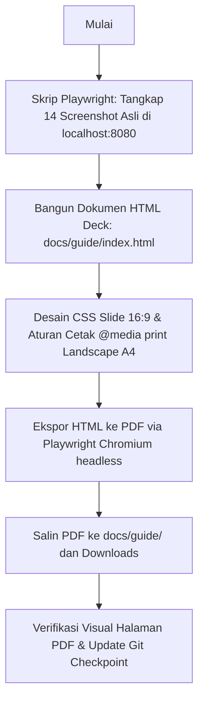

# Implementation Plan: Panduan Lengkap Pengguna LMS UOB My Digital Space (Deck PDF & HTML)

Dokumen ini menjabarkan rencana pembuatan berkas panduan pengguna (User Onboarding & Navigation Guide Deck) dalam format **HTML Presentation Slides** yang dikonversi menjadi **PDF Landscape A4 berkualitas tinggi**, lengkap dengan tangkapan layar asli (*real screenshots*) langkah demi langkah untuk memudahkan pengguna baru atau evaluator dalam mencoba platform LMS Asynchronous UOB My Digital Space.

---

## 1. Tujuan & Ruang Lingkup

Menghasilkan panduan visual komprehensif yang memandu pengguna langkah demi langkah dari awal membuka portal, memilih sekolah, memasukkan identitas/email siswa, membaca slide pengantar, menonton video kurasi, mengerjakan pop-up kuis, mengumpulkan tantangan praktik mandiri, hingga membuka tab kelulusan dan mengunduh sertifikat resmi 2 halaman.

### Deliverable Utama:
1. **Asset Tangkapan Layar Langkah demi Langkah (`docs/guide/assets/`)**:
   - Screenshot resolusi tinggi yang ditangkap langsung via Playwright Chromium dari instance LMS aktif (`http://localhost:8080/`):
     - `step_01_portal_login.png`: Tampilan awal portal & pencarian sekolah mitra.
     - `step_02_school_dropdown.png`: Pilihan dropdown sekolah & auto-detect jenjang.
     - `step_03_student_email_select.png`: Pemilihan email siswa & validasi data.
     - `step_04_dashboard_overview.png`: Tampilan dashboard siswa, topbar, dan progress bar misi.
     - `step_05_sidebar_navigation.png`: Sidebar modul belajar, status ikon (centang, play, gembok terkunci).
     - `step_06_reading_slide.png`: Antarmuka slide pembelajaran interaktif, navigasi slide, tombol perbesar.
     - `step_07_video_player.png`: Video player YouTube terkurasi, batas waktu materi, tombol rewatch 30s, dan bookmarks.
     - `step_08_interactive_quiz.png`: Notifikasi pop-up kuis less-strict, opsi jawaban, dan Bento Box tracker kuis.
     - `step_09_quiz_feedback.png`: Umpan balik nilai kuis instan & terbukanya kunci materi selanjutnya.
     - `step_10_challenge_panel.png`: Panel form Tantangan Praktik Mandiri (Python/Scratch/App Inventor).
     - `step_11_certificate_unlocked.png`: Tab sidebar sertifikat terbuka setelah 100% tuntas.
     - `step_12_cert_page1.png`: Pratinjau Sertifikat Kelulusan resmi (Halaman 1 Landscape A4).
     - `step_13_cert_page2.png`: Pratinjau Transkrip Hasil Evaluasi Belajar (Halaman 2 Portrait A4).
     - `step_14_mobile_advisory.png`: Dialog saran perangkat laptop/komputer untuk kenyamanan koding.
2. **Interactive HTML Slide Deck (`docs/guide/index.html`)**:
   - Presentasi slide 16:9 modern bertema luar angkasa khas UOB My Digital Space (navy blue, golden accents, Plus Jakarta Sans, Inter, skeuomorphic badges, step callouts).
   - Fitur interaktif di browser: Navigasi slide (Next/Prev, Keyboard Arrow, Jump select, Fullscreen presentation mode, Auto-fit scale).
   - Aturan `@media print` presisi untuk konversi cetak ke PDF ukuran A4 Landscape tanpa margin terpotong.
3. **Berkas PDF Siap Pakai (`docs/guide/panduan-pengguna-lms-uob.pdf`)**:
   - Dihasilkan langsung dari HTML menggunakan headless Chromium Playwright dengan styling grafis latar belakang aktif (`print_background=True`).
   - Disalin juga ke folder `Downloads` pengguna agar dapat langsung dibuka dan dibagikan.

---

## 2. Struktur Slide Panduan Pengguna (Revisi Seamless Portal & Matriks Abridged)

Deck panduan diselaraskan 100% dengan estetika visual portal LMS (*deep space navy, starfield dots, floating planets, dual branding Ruangguru x UOB, jenjang badges, dan 3D tactile skeuomorphic buttons*) serta diperkaya dengan matriks kurikulum abridged per jenjang (SD, SMP, SMA):

- **Slide 1: Cover & Pengantar Resmi**:
  - Dual Logo resmi Ruangguru dan UOB Indonesia, floating space planets, dan starfield background.
  - Judul: *Panduan Lengkap Pengguna & Navigasi Belajar Mandiri — UOB My Digital Space*.
  - Jenjang Badges resmi: `SD · Scratch Logic`, `SMP · App Inventor`, `SMA · Python Coding`.
  - 4 Pilar belajar: Akses Mandiri, Materi Terkurasi, Kuis Interaktif, dan Sertifikat Kelulusan 2 Halaman.
- **Slide 2: Persiapan Perangkat & Rekomendasi Penggunaan**:
  - Rekomendasi perangkat: Laptop/PC (layar ≥ 1024px) dengan Google Chrome/Edge.
  - Tangkapan layar asli **Mobile Gentle Advisory Modal** (`step_14_mobile_advisory.png`) yang ramah bagi siswa saat mengakses via smartphone.
- **Slide 3: Langkah 1 — Membuka Portal & Mencari Nama Sekolah**:
  - URL portal LMS (`http://localhost:8080/` atau URL Vercel).
  - Panduan interaktif fitur combobox pencarian nama sekolah (misal: "andalus").
  - Auto-detection jenjang otomatis (SD / SMP / SMA).
  - Tangkapan layar: `step_01_portal_login.png` & `step_02_school_dropdown.png`.
- **Slide 4: Langkah 2 — Memilih Email Siswa & Masuk ke Kelas**:
  - Pemilihan email/nama siswa terdaftar, konfirmasi identitas kelas.
  - Tombol 3D skeuomorphic *"Masuk ke Kelas"*.
  - Tangkapan layar: `step_03_student_email_select.png`.
- **Slide 5: [BARU] Matriks Kurikulum Abridged Per Jenjang (SD, SMP, SMA)**:
  - Tabel perbandingan komprehensif 3 jenjang:
    - **SD (Scratch)**: 4 Modul · 18 Step (1 Slide Pengantar · 17 Video Tutorial · 18 Kuis Interaktif · 3 Proyek Hands-on di Scratch Editor).
    - **SMP (App Inventor)**: 6 Modul · 36 Step (4 Slide Bacaan · 24 Video Tutorial · 46 Kuis · 8 Mini Project yang Bisa Dikumpul).
    - **SMA (Python)**: 6 Modul · 36 Step (6 Slide Bacaan · 23 Video Tutorial · 59 Kuis · 7 Mini Project yang Bisa Dikumpul).
- **Slide 6: [BARU] Detail Modul & Mini Project yang Dapat Dikumpulkan**:
  - Rincian kurikulum dan daftar judul mini project tiap jenjang:
    - **SD**: Modul 0 Kenalan Scratch, Modul 1 About Me (7 video), Modul 2 Racing Car (6 video), Modul 3 Increase Your Earnings (4 video).
    - **SMP**: 8 Mini Project (Form Aman, Cek Pesan Aman, Final Project If-Else, Kalkulator Prosedur, Tiny DB, Mini Project C, Solusi Digital, Final Project App).
    - **SMA**: 7 Mini Project (Smart Budget & Risk Planner, Mini Project Optimasi, Mini Project Fungsi, Safe Transaction Input, Safe Input Error Handling, Debugging Program Belanja, Financial Literacy Capstone).
- **Slide 7: Langkah 3 — Mengenal Beranda Belajar (Dashboard & Sidebar)**:
  - Anatomi Topbar profil siswa & Sidebar Misi dengan indikator visual (✓ Selesai Hijau, ▶ Aktif Biru, 🔒 Terkunci Abu-abu).
  - Tangkapan layar: `step_04_dashboard_overview.png` & `step_05_sidebar_navigation.png`.
- **Slide 8: Langkah 4 — Membaca & Mempelajari Slide Interaktif**:
  - Mempelajari slide fondasi konsep mandiri, navigasi, code preview, dan kotak rangkuman.
  - Tangkapan layar: `step_06_reading_slide.png`.
- **Slide 9: Langkah 5 — Menonton Video Modul Terkurasi**:
  - Pemutar video YouTube terintegrasi, seek bar, tombol *"Tonton Ulang 30 Detik"*, dan bookmark topik.
  - Tangkapan layar: `step_07_video_player.png`.
- **Slide 10: Langkah 6 — Menjawab Kuis Pop-up Interaktif**:
  - Penjelasan kuis ramah *Less-Strict*, kartu opsi 3D (A, B, C, D), dan Bento Box tracker status soal.
  - Tangkapan layar: `step_08_interactive_quiz.png`.
- **Slide 11: Langkah 7 — Umpan Balik Kuis & Buka Materi Selanjutnya**:
  - Umpan balik instan jawaban benar & tombol *"Materi Selanjutnya"* membuka gembok materi berikutnya.
  - Tangkapan layar: `step_09_quiz_feedback.png`.
- **Slide 12: Langkah 8 — Mengerjakan Tantangan Praktik (Mini Project Panel)**:
  - Panel form Mini Project non-gating: input formulir fleksibel (editor kode Python, link Colab/GitHub/App Inventor/Scratch, upload berkas).
  - Tangkapan layar: `step_10_challenge_panel.png`.
- **Slide 13: Langkah 9 — Mengklaim & Mengunduh Sertifikat Resmi (2 Halaman)**:
  - Terbukanya menu `🎓 Sertifikat & Rekap Nilai`.
  - Halaman 1: Sertifikat Kelulusan resmi berbingkai emas & stempel 3D (Landscape A4).
  - Halaman 2: Transkrip Akademik resmi full-length dengan rekap seluruh materi & matriks 4 kompetensi (Portrait A4).
  - Tangkapan layar: `step_11_certificate_unlocked.png`, `step_12_cert_page1.png`, & `step_13_cert_page2.png`.
- **Slide 14: Penutup, Tips Sukses Belajar, & Pusat Bantuan**:
  - 3 Tips sukses belajar mandiri (Rutin, Praktik, Ulang Video), FAQ umum, dan kontak tim bantuan teknis Ruangguru x UOB Indonesia.

  - Advisory modal ramah saat dibuka di HP/smartphone.
  - Bantuan teknis & tombol kontak WhatsApp Fasilitator Kalananti.

---

## 3. Rencana Eksekusi Teknis

### Langkah 1: Pengambilan Tangkapan Layar Otomatis (`scratch/capture_guide_screenshots.py`)
- Menjalankan Playwright script untuk berinteraksi dengan server lokal `http://localhost:8080/`.
- Menangkap tampilan:
  1. Halaman Login bersih.
  2. Input pencarian sekolah (misal: "SD AL ANDALUS" atau "SMAN 20 BATAM").
  3. Dropdown pilihan email siswa (misal: "Raffa ghaisan" / "Intan Nuraini").
  4. Dashboard siswa aktif dengan sidebar modul.
  5. Detail slide pembelajaran dengan kartu preview kode & kartu rangkuman.
  6. Video player YouTube dengan seek bar dan bookmark strip.
  7. Pop-up modal kuis & Bento box list.
  8. Umpan balik sukses kuis & terbukanya kunci navigasi.
  9. Formulir Tantangan Praktik Mandiri.
  10. Tab sertifikat terbuka & pratinjau 2 halaman sertifikat (Page 1 Landscape & Page 2 Portrait).
  11. Mobile Advisory modal.
- Menyimpan semua aset ke `projects/uob-async-lms/docs/guide/assets/`.

### Langkah 2: Pembuatan Berkas HTML Deck (`docs/guide/index.html`)
- Menggunakan arsitektur web modern:
  - Font Google: **Plus Jakarta Sans**, **Space Grotesk**, dan **Fira Code**.
  - Tema visual: UOB Space Blue & Dark Glassmorphism, konsisten dengan LMS UOB.
  - Setiap slide memiliki container 16:9 (`1920x1080` atau rasio responsif) dengan header pill langkah, judul jelas, panduan instruksi poin per poin, callout tips warna-warni, dan tangkapan layar berbingkai elegan.
  - Controller navigasi slide di bawah (Previous, Next, Jump select, Progress bar, Slide counter, Tombol Cetak PDF).
  - CSS `@page { size: A4 landscape; margin: 0; }` agar saat diekspor ke PDF, setiap slide menjadi 1 halaman A4 landscape yang pas tanpa overflow.

### Langkah 3: Konversi HTML ke PDF (`scratch/export_guide_pdf.py`)
- Membuka `docs/guide/index.html` via Playwright Chromium.
- Menjalankan `page.pdf(...)` dengan opsi:
  - `format='A4'`, `landscape=True`, `print_background=True`, `margin={'top':'0','bottom':'0','left':'0','right':'0'}`.
- Menyimpan output PDF ke:
  - `projects/uob-async-lms/docs/guide/panduan-pengguna-lms-uob.pdf`
  - `/Users/yazidhilmi/Downloads/Panduan_Pengguna_LMS_UOB_My_Digital_Space.pdf`

---

## 4. Rencana Verifikasi

1. **Kelengkapan Materi**:
   - Seluruh pertanyaan pengguna (cara membuka, cari nama sekolah, cari email siswa, step-by-step membaca materi, mengerjakan kuis/tugas, mengumpulkan, dan klaim sertifikat) terjawab tuntas dengan bukti visual.
2. **Kualitas Visual & Render PDF**:
   - Memastikan tidak ada teks yang terpotong atau halaman kosong (*blank pages*).
   - Memastikan rasio screenshot proporsional dan teks petunjuk mudah dibaca oleh pengguna pemula.
   - Memastikan ukuran berkas PDF optimal (< 15 MB) dan siap dicetak atau dibagikan via WhatsApp/Email.
3. **Sinkronisasi & Git**:
   - Sinkronisasi berkas panduan ke `subprojects/01-lms-platform/` dan `docs/`.
   - Melakukan git commit checkpoint.
