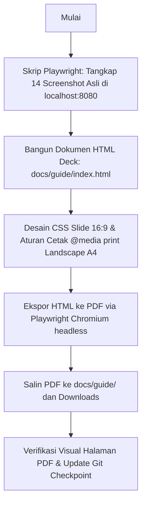

# Implementation Plan: Panduan Lengkap Pengguna LMS UOB My Digital Space (Deck PDF & HTML)

Dokumen ini menjabarkan rencana pembuatan berkas panduan pengguna (User Onboarding & Navigation Guide Deck) dalam format **HTML Presentation Slides** yang dikonversi menjadi **PDF Landscape A4 berkualitas tinggi**, lengkap dengan tangkapan layar asli (*real screenshots*) langkah demi langkah untuk memudahkan pengguna baru atau evaluator dalam mencoba platform LMS Asynchronous UOB My Digital Space.

---

## 1. Tujuan & Ruang Lingkup

Menghasilkan panduan visual komprehensif yang memandu pengguna langkah demi langkah dari awal membuka portal, memilih sekolah, memasukkan identitas/email siswa, membaca slide pengantar, menonton video kurasi, mengerjakan pop-up kuis, mengumpulkan tantangan praktik mandiri, hingga membuka tab kelulusan dan mengunduh sertifikat resmi 2 halaman.

### Deliverable Utama:
1. **Asset Tangkapan Layar Langkah demi Langkah (`docs/guide/assets/`)**:
   - Screenshot resolusi tinggi yang ditangkap langsung via Playwright Chromium dari instance LMS aktif (`http://localhost:8080/`):
     - `step_01_portal_login.png`: Tampilan awal portal & pencarian sekolah mitra.
     - `step_02_school_dropdown.png`: Pilihan dropdown sekolah & auto-detect jenjang.
     - `step_03_student_email_select.png`: Pemilihan email siswa & validasi data.
     - `step_04_dashboard_overview.png`: Tampilan dashboard siswa, topbar, dan progress bar misi.
     - `step_05_sidebar_navigation.png`: Sidebar modul belajar, status ikon (centang, play, gembok terkunci).
     - `step_06_reading_slide.png`: Antarmuka slide pembelajaran interaktif, navigasi slide, tombol perbesar.
     - `step_07_video_player.png`: Video player YouTube terkurasi, batas waktu materi, tombol rewatch 30s, dan bookmarks.
     - `step_08_interactive_quiz.png`: Notifikasi pop-up kuis less-strict, opsi jawaban, dan Bento Box tracker kuis.
     - `step_09_quiz_feedback.png`: Umpan balik nilai kuis instan & terbukanya kunci materi selanjutnya.
     - `step_10_challenge_panel.png`: Panel form Tantangan Praktik Mandiri (Python/Scratch/App Inventor).
     - `step_11_certificate_unlocked.png`: Tab sidebar sertifikat terbuka setelah 100% tuntas.
     - `step_12_cert_page1.png`: Pratinjau Sertifikat Kelulusan resmi (Halaman 1 Landscape A4).
     - `step_13_cert_page2.png`: Pratinjau Transkrip Hasil Evaluasi Belajar (Halaman 2 Portrait A4).
     - `step_14_mobile_advisory.png`: Dialog saran perangkat laptop/komputer untuk kenyamanan koding.
2. **Interactive HTML Slide Deck (`docs/guide/index.html`)**:
   - Presentasi slide 16:9 modern bertema luar angkasa khas UOB My Digital Space (navy blue, golden accents, Plus Jakarta Sans, Inter, skeuomorphic badges, step callouts).
   - Fitur interaktif di browser: Navigasi slide (Next/Prev, Keyboard Arrow, Jump select, Fullscreen presentation mode, Auto-fit scale).
   - Aturan `@media print` presisi untuk konversi cetak ke PDF ukuran A4 Landscape tanpa margin terpotong.
3. **Berkas PDF Siap Pakai (`docs/guide/panduan-pengguna-lms-uob.pdf`)**:
   - Dihasilkan langsung dari HTML menggunakan headless Chromium Playwright dengan styling grafis latar belakang aktif (`print_background=True`).
   - Disalin juga ke folder `Downloads` pengguna agar dapat langsung dibuka dan dibagikan.

---

## 2. Struktur Slide Panduan Pengguna

Deck panduan akan terdiri dari 12 slide terstruktur:

- **Slide 1: Judul & Pengantar**:
  - *Panduan Pengguna Baru LMS UOB My Digital Space* — Asynchronous Learning Platform SD, SMP & SMA.
  - Ringkasan tujuan program beasiswa dan teknologi single-portal.
- **Slide 2: Peta Alur Belajar Siswa (Student Journey Overview)**:
  - Diagram visual 6 langkah utama: Akses Portal → Input Identitas → Eksplorasi Sidebar → Belajar Materi → Selesaikan Kuis & Praktik → Unduh Sertifikat Resmi.
- **Slide 3: Langkah 1 — Membuka Portal & Memilih Sekolah Mitra**:
  - Akses URL portal LMS.
  - Cara mencari nama sekolah di combobox pintar.
  - Penjelasan deteksi otomatis jenjang (SD / SMP / SMA).
- **Slide 4: Langkah 2 — Memasukkan Email & Nama Siswa**:
  - Memilih atau mengetik email siswa terdaftar.
  - Cara menemukan email jika siswa belum tahu (referensi data sekolah / PIC).
  - Validasi data & tombol "Mulai Belajar Sekarang".
- **Slide 5: Langkah 3 — Mengenal Dashboard & Navigasi Modul (Sidebar)**:
  - Anatomi dashboard: Topbar identitas siswa & sidebar materi misi.
  - Arti 3 status materi: Selesai (✓), Sedang Berjalan (▶), dan Terkunci (🔒).
  - Indikator progres misi ("Progres: X dari Y Materi").
- **Slide 6: Langkah 4 — Membaca Slide Pembelajaran (Materi Bacaan/Jembatan)**:
  - Mempelajari slide fondasi konsep untuk siswa pemula mutlak.
  - Navigasi slide sebelumnya/selanjutnya, mode fullscreen, dan kartu rangkuman.
- **Slide 7: Langkah 5 — Menonton Video Tutorial Pembelajaran**:
  - Player video YouTube terkurasi (hanya memutar segmen materi penting).
  - Menggunakan bookmark topik dan fitur putar ulang 30 detik (*Rewatch 30s*).
- **Slide 8: Langkah 6 — Menjawab Pop-Up Kuis Interaktif**:
  - Munculnya pop-up kuis non-blocking yang ramah (*less-strict*).
  - Memilih jawaban, memeriksa feedback nilai instan.
  - Membuka kunci tombol "Materi Selanjutnya".
- **Slide 9: Langkah 7 — Mengerjakan Tantangan Praktik Mandiri (Mini Project)**:
  - Praktik membuat kode di Google Colab / Scratch / App Inventor.
  - Mengirimkan link proyek atau file tugas (bersifat non-gating).
- **Slide 10: Langkah 8 — Membuka Tab Sertifikat & Rekap Nilai**:
  - Terbukanya tab `🎓 Sertifikat & Rekap Nilai` di sidebar setelah 100% misi tuntas.
  - Tampilan Halaman 1: Certificate of Completion berbingkai emas & stempel 3D.
  - Tampilan Halaman 2: Transkrip Hasil Evaluasi Belajar full-length A4 dengan matriks 4 kompetensi.
- **Slide 11: Langkah 9 — Mengunduh & Mencetak Berkas PDF Sertifikat**:
  - Mengklik tombol "Cetak / Simpan PDF" di modal sertifikat.
  - Mendapatkan dokumen 2 halaman resmi beresolusi tinggi tanpa watermark pratinjau.
- **Slide 12: Panduan Perangkat, Troubleshooting & Bantuan Fasilitator**:
  - Rekomendasi perangkat laptop/desktop/Chromebook.
  - Advisory modal ramah saat dibuka di HP/smartphone.
  - Bantuan teknis & tombol kontak WhatsApp Fasilitator Kalananti.

---

## 3. Rencana Eksekusi Teknis

### Langkah 1: Pengambilan Tangkapan Layar Otomatis (`scratch/capture_guide_screenshots.py`)
- Menjalankan Playwright script untuk berinteraksi dengan server lokal `http://localhost:8080/`.
- Menangkap tampilan:
  1. Halaman Login bersih.
  2. Input pencarian sekolah (misal: "SD AL ANDALUS" atau "SMAN 20 BATAM").
  3. Dropdown pilihan email siswa (misal: "Raffa ghaisan" / "Intan Nuraini").
  4. Dashboard siswa aktif dengan sidebar modul.
  5. Detail slide pembelajaran dengan kartu preview kode & kartu rangkuman.
  6. Video player YouTube dengan seek bar dan bookmark strip.
  7. Pop-up modal kuis & Bento box list.
  8. Umpan balik sukses kuis & terbukanya kunci navigasi.
  9. Formulir Tantangan Praktik Mandiri.
  10. Tab sertifikat terbuka & pratinjau 2 halaman sertifikat (Page 1 Landscape & Page 2 Portrait).
  11. Mobile Advisory modal.
- Menyimpan semua aset ke `projects/uob-async-lms/docs/guide/assets/`.

### Langkah 2: Pembuatan Berkas HTML Deck (`docs/guide/index.html`)
- Menggunakan arsitektur web modern:
  - Font Google: **Plus Jakarta Sans**, **Space Grotesk**, dan **Fira Code**.
  - Tema visual: UOB Space Blue & Dark Glassmorphism, konsisten dengan LMS UOB.
  - Setiap slide memiliki container 16:9 (`1920x1080` atau rasio responsif) dengan header pill langkah, judul jelas, panduan instruksi poin per poin, callout tips warna-warni, dan tangkapan layar berbingkai elegan.
  - Controller navigasi slide di bawah (Previous, Next, Jump select, Progress bar, Slide counter, Tombol Cetak PDF).
  - CSS `@page { size: A4 landscape; margin: 0; }` agar saat diekspor ke PDF, setiap slide menjadi 1 halaman A4 landscape yang pas tanpa overflow.

### Langkah 3: Konversi HTML ke PDF (`scratch/export_guide_pdf.py`)
- Membuka `docs/guide/index.html` via Playwright Chromium.
- Menjalankan `page.pdf(...)` dengan opsi:
  - `format='A4'`, `landscape=True`, `print_background=True`, `margin={'top':'0','bottom':'0','left':'0','right':'0'}`.
- Menyimpan output PDF ke:
  - `projects/uob-async-lms/docs/guide/panduan-pengguna-lms-uob.pdf`
  - `/Users/yazidhilmi/Downloads/Panduan_Pengguna_LMS_UOB_My_Digital_Space.pdf`

---

## 4. Rencana Verifikasi

1. **Kelengkapan Materi**:
   - Seluruh pertanyaan pengguna (cara membuka, cari nama sekolah, cari email siswa, step-by-step membaca materi, mengerjakan kuis/tugas, mengumpulkan, dan klaim sertifikat) terjawab tuntas dengan bukti visual.
2. **Kualitas Visual & Render PDF**:
   - Memastikan tidak ada teks yang terpotong atau halaman kosong (*blank pages*).
   - Memastikan rasio screenshot proporsional dan teks petunjuk mudah dibaca oleh pengguna pemula.
   - Memastikan ukuran berkas PDF optimal (< 15 MB) dan siap dicetak atau dibagikan via WhatsApp/Email.
3. **Sinkronisasi & Git**:
   - Sinkronisasi berkas panduan ke `subprojects/01-lms-platform/` dan `docs/`.
   - Melakukan git commit checkpoint.
